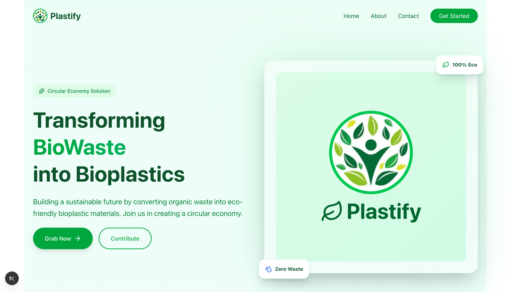
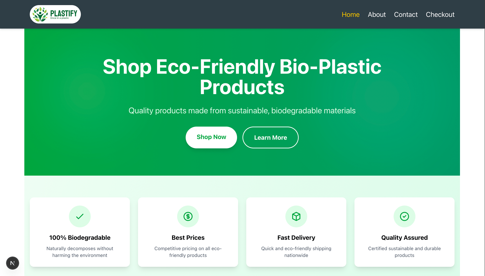
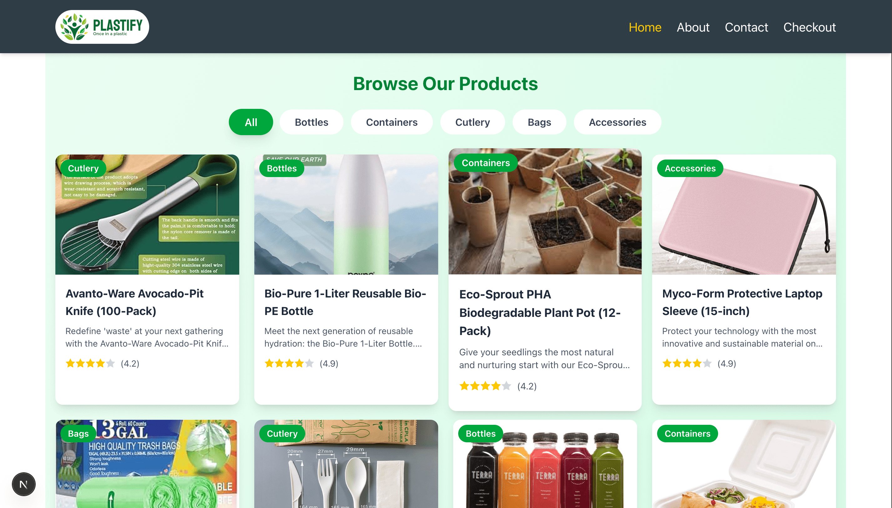
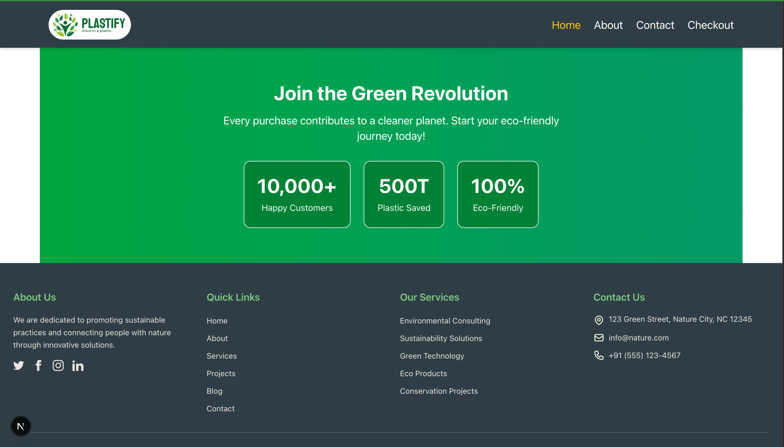
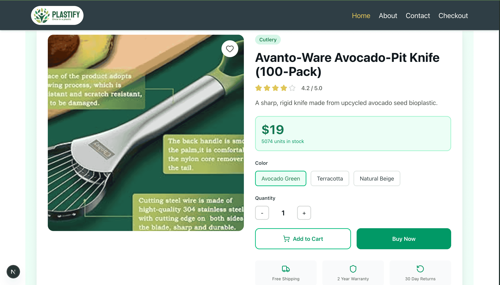
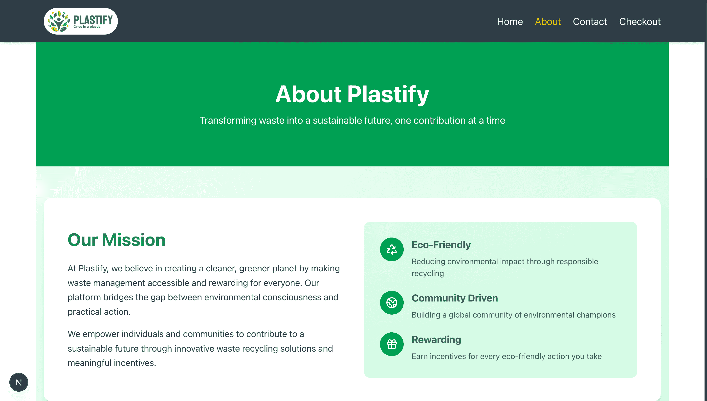
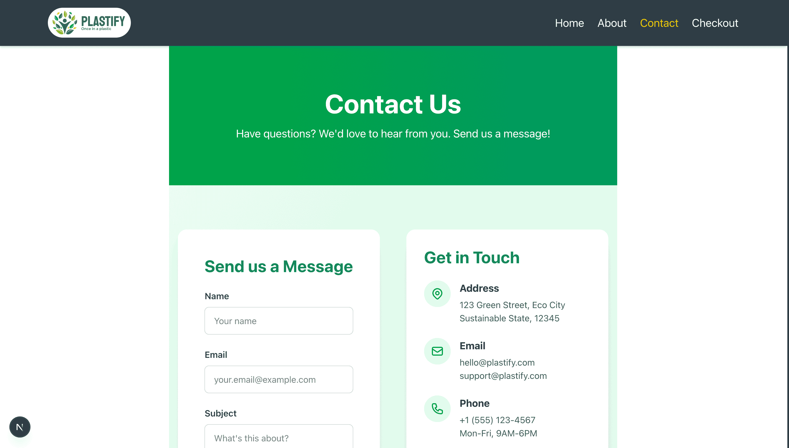
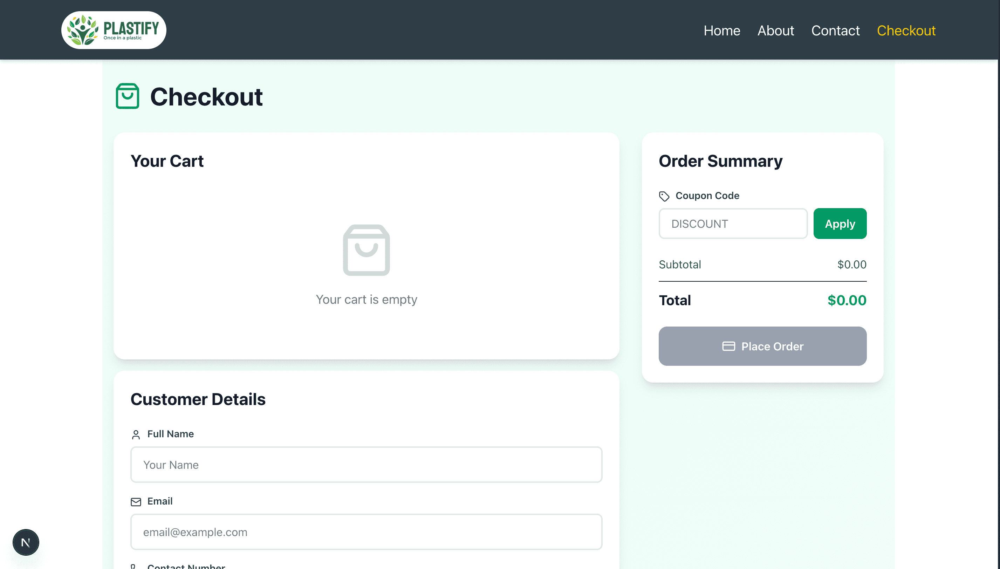
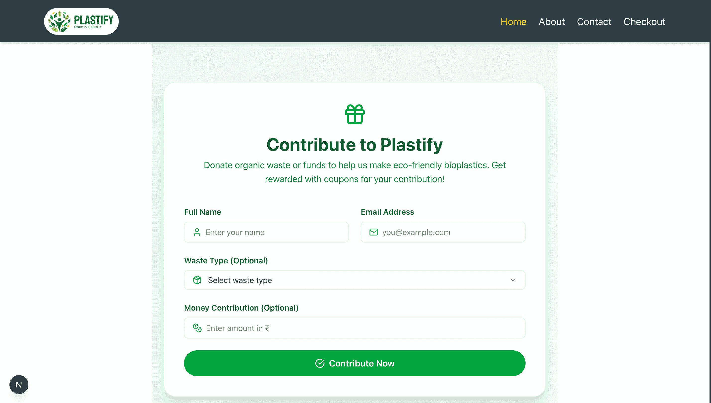

# 🌱 Plastify - Sustainable Plastic Revolution (1st Year REPO)


## Overview

Plastify is an innovative web platform revolutionizing waste management and sustainable manufacturing through a circular economy model. We transform organic bio-waste into high-quality, biodegradable plastic products, reducing environmental pollution while creating sustainable alternatives to traditional plastics.

### LandingPage


<br/><br/><hr/>

### HomePage






<br/><br/><hr/>

### Product


<br/><br/><hr/>

### About Page


<br/><br/><hr/>

### Contact Page


<br/><br/><hr/>

### Checkout


<br/><br/><hr/>

### Contribution


<br/><br/><hr/>

> **Note:** This is an academic project developed for educational purposes to demonstrate sustainable technology solutions.

## Mission

Our mission is simple yet powerful:

- Reduce environmental pollution
- Create sustainable alternatives to traditional plastics
- Empower communities to participate in the green revolution
- Build a cleaner, greener planet

## Features

- **Product Catalog** - Browse eco-friendly biodegradable plastic products
- **Order Management** - Seamless ordering system for sustainable products
- **Coupon Code** - Use Coupon Code for discount
- **Dashboard** - Track environmental impact and contributions
- **Impact Tracker** - Visualize waste reduction and sustainability metrics
- **Modern UI/UX** - Clean, intuitive interface built with Tailwind CSS

## Tech Stack

### Frontend

- **Framework:** [Next.js](https://nextjs.org/) - React framework for production
- **Styling:** [Tailwind CSS](https://tailwindcss.com/) - Utility-first CSS framework
- **Icons:** [Lucide React](https://lucide.dev/) - Beautiful, consistent icons
- **Notifications:** [React Toastify](https://fkhadra.github.io/react-toastify/) - Elegant toast notifications
- **Alerts:** [SweetAlert2](https://sweetalert2.github.io/) - Beautiful, responsive alerts

### Backend

- **Database:** [MongoDB](https://www.mongodb.com/) - NoSQL database for flexible data storage
- **PDF Generation:** [jsPDF](https://github.com/parallax/jsPDF) - Client-side PDF generation

### Development Tools

- **Language:** JavaScript
- **Package Manager:** npm
- **Version Control:** Git

## Installation

### Prerequisites

- Node.js
- npm or yarn
- MongoDB

### Setup Instructions

1. **Clone the repository**

```bash
git clone https://github.com/yourusername/plastify.git
cd plastify
```

2. **Install dependencies**

```bash
npm install
```

3. **Install required packages**

```bash
npm install jspdf
npm install lucide-react
npm install sweetalert2
npm install react-toastify
```

4. **Set up environment variables**

Create a `.env.local` file in the root directory:

```env
MONGODB_URI=your_mongodb_connection_string
NEXT_PUBLIC_IMAGE=/img/products
DatabaseName=Plastify
```

5. **Run the development server**

```bash
npm run dev
```

6. **Open your browser**
   Navigate to [http://localhost:3000](http://localhost:3000)

## Build for Production

```bash
npm run build
npm start
```

# Key Features Explained

### What We Do

Plastify transforms organic bio-waste that would otherwise end up in landfills into high-quality, biodegradable plastic products. Every product we create serves a practical purpose and represents a step toward a cleaner, greener planet.

### Circular Economy Model

We follow a complete circular economy approach:

1. Collect organic bio-waste
2. Process and transform into biodegradable materials
3. Manufacture high-quality products
4. Products return to nature safely

## Contributing

This is an academic project, but suggestions and feedback are welcome!

1. Fork the repository
2. Create your feature branch
3. Commit your changes
4. Push to the branch
5. Open a Pull Request

## License

This project is created for academic purposes only.

## Team

Created by Abhisek Dash

## Contact

For questions or feedback about this academic project:

- Project Link: [https://github.com/Abhisek-Dash-Official/Plastify](https://github.com/Abhisek-Dash-Official/Plastify)

## Acknowledgments

- Inspired by real-world sustainable technology initiatives
- Built with love for the environment

---

**⚠️ Academic Disclaimer:** This is an educational project developed for learning purposes. It demonstrates sustainable technology concepts and web development skills.
